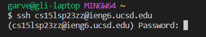

# Lab Report 1
*Garvey Li*

## Remote Access Walkthrough

**Steps**
1. Installing VSCode and GitBash
2. Remotely connecting
3. Trying some commands!

**Installing VSCode and GitBash**
1. Go to the [Visual Studio Code website](https://code.visualstudio.com/) and follow their instructions on downloading the version corresponding to your OS(macOS, Windows, Linux, etc)
2. If you are not using Windows, skip this step. Otherwise, go to the [website for Git](https://gitforwindows.org/) and follow the instructions for installation.
3. Open VSCode. It should look something like this.

   
   
   Now, open your terminal.
   
    * For Mac Users
        * Press Cmd + ` to open the terminal in VSCode
    * For Windows Users
        * Press Ctrl + ` to open the terminal in VSCode. 
        * In the top right corner of the terminal panel, click the down arrow next to the plus sign
        
        
        * Click on "Select Default Profile" and select Git Bash at the top of the window
        * Next to the down arrow you previously clicked, click on the + 

**Remotely connecting**
1. In your bash terminal, connect to remote computer by using the command `ssh cs15lsp23zz@ieng6.ucsd.edu`, where zz is whatever your username is.
2. Enter your account password. Don't worry if nothing shows up when you type, it's meant to do that. Just press enter once you've typed out your password

   
   
   If your password was correct, the output should look something like this:
   
   ```
   The authenticity of host 'ieng6.ucsd.edu (128.54.70.238)' can't be established.
   RSA key fingerprint is SHA256:ksruYwhnYH+sySHnHAtLUHngrPEyZTDl/1x99wUQcec.
   This key is not known by any other names
   Are you sure you want to continue connecting (yes/no/[fingerprint])? 
   Please type 'yes', 'no' or the fingerprint: yes
   ```
3. Type yes to continue. The next bit of output should now look like this: 

   ```
   Warning: Permanently added 'ieng6.ucsd.edu' (RSA) to the list of known hosts.
   (cs15lsp23zz@ieng6.ucsd.edu) Password:
   Last login: Tue Mar 14 17:32:19 2023 from 128.54.202.210
   Attempting to create directory /home/linux/ieng6/cs15lsp23/cs15lsp23zz/perl5
   ============================ NOTICE =================================
   Authorized use of this system is limited to password-authenticated
   usernames which are issued to individuals and are for the sole use of
   the person to whom they are issued.

   Privacy notice: be aware that computer files, electronic mail and
   accounts are not private in an absolute sense.  You are responsible
   for adhering to the ETS Acceptable Use Policies, which you can review at:
   https://blink.ucsd.edu/faculty/instruction/tech-guide/policies/ets-acceptable-use-policies.html
   =====================================================================

   *** Problems, Suggestions, or Feedback ***

       For help requests, please create a ticket at:
       https://support.ucsd.edu/its

       You may also report issues, suggestions, or feedback by e-mailing root on any system:
       mail -s "Your subject here" root
       Type your message - Ctrl+D to send

   *** Access our Linux ssh terminals or remote desktops via a web browser at: ***
       https://linuxcloud.ucsd.edu

       All accounts must be enrolled in Duo for access. No VPN required.


   -------------------------------------------------------

   Hello cs15lsp23zz, you are currently logged into ieng6-203.ucsd.edu

   You are using 0% CPU on this system

   Cluster Status
   Hostname     Time    #Users  Load  Averages
   ieng6-201   08:25:01   9  0.37,  0.13,  0.13
   ieng6-202   08:25:01   4  0.00,  0.04,  0.10
   ieng6-203   08:25:01   4  0.02,  0.04,  0.10


   Thu Apr 06, 2023  8:27am - Prepping cs15lsp23
   [cs15lsp23zz@ieng6-203]:~:1$

   ```

4. Now that you're connected, let's try some commands.

**Trying some Commands!**

