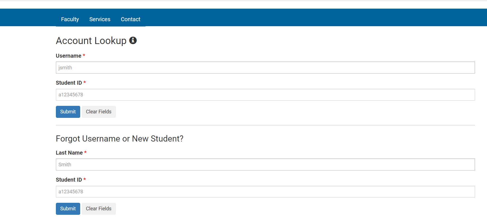

# Lab Report 1
*Garvey Li*

## Remote Access Walkthrough

**Steps**
1. Finding your CSE15L account(and resetting your password)
2. Installing VSCode and GitBash
3. Remotely connecting
4. Trying some commands!

**Finding your CSE15L account(and resetting your password)**
1. Go to https://sdacs.ucsd.edu/~icc/index.php and look up your account using your username (email addresd minus the @ucsd.edu) and PID (AXXXXXXXX). If you don't know your username, you can also use your last name in the 2nd entry for account lookup.



3. Once the lookup is successful, there should be an account name cs15l followed by the term and your id/username for remote connecting. It might look something like cs15lsp23zz (sp23 is the term and zz is the id/username). Copy the entire account name so you can use it later.


3. Click on the box containing your account username and it should take you to this page. If you ever need to reset your password, you can do it here.


4. If you don't know your password or haven't set it, click on the password change tool link above. Then click on "Proceed to the password change tool".


5. In the entry box available, enter the cse15l account user name you copy pasted (the one that looks like cs15lsp23zz).
6. Click on the "I want to reset my course-specific account password". This will ask for a duo authentication. Confirm it. 
7. The page will ask to send an email with instructions on resetting your password. Click yes.
8. Go to your email and open up the email you received. Click on the "UC San Diego password reset page" hyperlink.
9. Type in your new password and confirm it. Then click "Change Password"
10. Your password should be reset


**Installing VSCode and GitBash**
1. Go to the [Visual Studio Code website](https://code.visualstudio.com/) and follow their instructions on downloading the version corresponding to your OS(macOS, Windows, Linux, etc)
2. If you are not using Windows, skip this step. Otherwise, go to the [website for Git](https://gitforwindows.org/) and follow the instructions for installation.
3. Open VSCode. It should look something like this.

   
   
   Now, open your terminal.
   
    * For Mac Users
        * Press Cmd + ` to open the terminal in VSCode
    * For Windows Users
        * Press Ctrl + ` to open the terminal in VSCode. 
        * In the top right corner of the terminal panel, click the down arrow next to the plus sign
        
        
        * Click on "Select Default Profile" and select Git Bash at the top of the window
        * Next to the down arrow you previously clicked, click on the + 

**Remotely connecting**
1. In your bash terminal, connect to remote computer by using the command `ssh cs15lsp23zz@ieng6.ucsd.edu`, where zz is whatever your username is.
2. Enter your account password. Don't worry if nothing shows up when you type, it's meant to do that. Just press enter once you've typed out your password

   
   
   If your password was incorrect, make sure you're typing it out correctly, or try resetting your account password(Steps 4-10 in the first section)
   
   If your password was correct, the output should look something like this:
   
   ```
   The authenticity of host 'ieng6.ucsd.edu (128.54.70.238)' can't be established.
   RSA key fingerprint is SHA256:ksruYwhnYH+sySHnHAtLUHngrPEyZTDl/1x99wUQcec.
   This key is not known by any other names
   Are you sure you want to continue connecting (yes/no/[fingerprint])? 
   Please type 'yes', 'no' or the fingerprint: 
   ```
   
3. Enter yes to continue. The next bit of output should now look like this: 

   ```
   Warning: Permanently added 'ieng6.ucsd.edu' (RSA) to the list of known hosts.
   (cs15lsp23zz@ieng6.ucsd.edu) Password:
   Last login: Tue Mar 14 17:32:19 2023 from 128.54.202.210
   Attempting to create directory /home/linux/ieng6/cs15lsp23/cs15lsp23zz/perl5
   ============================ NOTICE =================================
   Authorized use of this system is limited to password-authenticated
   usernames which are issued to individuals and are for the sole use of
   the person to whom they are issued.

   Privacy notice: be aware that computer files, electronic mail and
   accounts are not private in an absolute sense.  You are responsible
   for adhering to the ETS Acceptable Use Policies, which you can review at:
   https://blink.ucsd.edu/faculty/instruction/tech-guide/policies/ets-acceptable-use-policies.html
   =====================================================================

   *** Problems, Suggestions, or Feedback ***

       For help requests, please create a ticket at:
       https://support.ucsd.edu/its

       You may also report issues, suggestions, or feedback by e-mailing root on any system:
       mail -s "Your subject here" root
       Type your message - Ctrl+D to send

   *** Access our Linux ssh terminals or remote desktops via a web browser at: ***
       https://linuxcloud.ucsd.edu

       All accounts must be enrolled in Duo for access. No VPN required.


   -------------------------------------------------------

   Hello cs15lsp23zz, you are currently logged into ieng6-203.ucsd.edu

   You are using 0% CPU on this system

   Cluster Status
   Hostname     Time    #Users  Load  Averages
   ieng6-201   08:25:01   9  0.37,  0.13,  0.13
   ieng6-202   08:25:01   4  0.00,  0.04,  0.10
   ieng6-203   08:25:01   4  0.02,  0.04,  0.10


   Thu Apr 06, 2023  8:27am - Prepping cs15lsp23
   [cs15lsp23zz@ieng6-203]:~:1$

   ```
   
   4. If you want to terminate your connection, hit Ctrl + D or Cmd + D in the terminal. Then you can close your terminal by entering the command `exit`

4. Now that you're connected, let's try some commands.

**Trying some Commands!**
* To check what directory your currently in, enter the command `pwd`
* To check the immediate contents of you current directory, enter the command `ls`
* To check the immediate contents of another sub-directory, enter the command `ls sub_directory_name`
* To navigate to a sub-directory, enter the command `cd sub_directory_name` 
* To go to the current directory's parent directory, enter the command `cd ..`
* To go back to the root directory, enter the command `cd`
* To make a new directory, enter the command `mkdir new_directory_name`
* To print the contents of a file, use the command `cat file_name` or `cat file_path` (you can have multiple files for this, just separate their names/paths with a space)
* To copy a file to a directory, use the command `cp file_name directory`

*Some examples*


