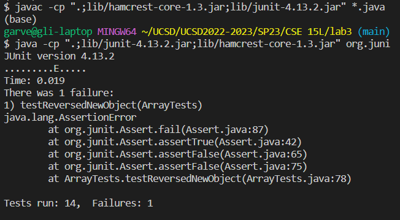
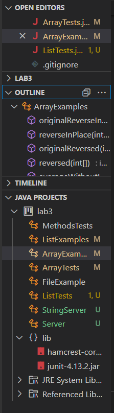

# Lab Report 2: Servers and Bugs

*Garvey Li*

## Part 1: String Server 

  **String Server Code**

    import java.io.IOException;
    import java.net.URI;

    class Handler implements URLHandler {
        String total_String = "";

        public String handleRequest(URI url) {
            if (url.getPath().equals("/")) {
                return "Garvey's String Server!";
            } else if (url.getPath().contains("/add-message")) {
                String[] parameters = url.getQuery().split("=");
                if (parameters[0].equals("s")) {
                    total_String += parameters[1] + "\n";
                    return total_String;
                } else {
                    return "404 Not Found!";
                }
            } else {
                System.out.println("Path: " + url.getPath());
                return "404 Not Found!";
            }
        }
    }

    public class StringServer {
        public static void main(String[] args) throws IOException {
            if(args.length == 0){
                System.out.println("Missing port number! Try any number between 1024 to 49151");
                return;
            }

            int port = Integer.parseInt(args[0]);

            Server.start(port, new Handler());
        }
    }

***/add-message?s=hihihi***

For using /add-message?s=hihihi, the handleRequest method is called. The relevant arguments to this method is the url as a URI object. For this specific call, the url is http://localhost:4000/add-message?s=hihihi. A relevenat field of the class is the String total_String, which is initialized as the empty string "". The getPath() method for URI objects is also called, which returns the URI's path as a String. This method is chained with .contains(String value), which checks if a value is in the String, or url in this case. 

Since the url contains /add-message, it splits the query by '=' and concatenates the value in the last indices of the array made by the split, which in this case is "hihihi", and a newline to the class field total_String. Then, the method returns total_String, which is then displayed on the webpage. Here, total_String is "hihihi\n", so 

hihihi 

is displayed on the webpage.

***/add-message?s=hehehehe***

For using /add-message?s=hehehehe, the handleRequest method is called. The relevant arguments to this method is the url as a URI object. For this specific call, the url is http://localhost:4000/add-message?s=hehehehe. A relevenat field of the class is the String total_String, which was initialized as the empty string "", but is now "hihihi\n" since http://localhost:4000/add-message?s=hihihi was called once before. The getPath() method for URI objects is also called, which returns the URI's path as a String. This method is chained with .contains(String value), which checks if a value is in the String, or url in this case. 

Since the url contains /add-message like before, it splits the query by '=' and concatenates the value in the last indices of the array made by the split, which in this case is "hehehehe", and a newline to the class field total_String. Then, the method returns total_String, which is then displayed on the webpage. Here, total_String is "hihihi\nhehehehe\n", so 

hihihi
hehehehe

is displayed on the webpage.

## Part 2: Bugs 

**Code with bug**

    public class ArrayExamples {
        static int[] reversed(int[] arr) {
        int[] newArray = new int[arr.length];
        for(int i = 0; i < arr.length; i += 1) {
        arr[i] = newArray[arr.length - i - 1];
            }
        return arr;
        }
    }

**JUnit tests**

*Failed test*

    public class ArrayTests {
        //Fails. Array being returned has the same memory location as the input.
        @Test
        public void testReversedNewObject() {
            int[] input = {1};
            assertFalse(input == ArrayExamples.reversed(input));
        }
    }

*Passed test*

    public class ArrayTests {
        void generalTestReversed(int[] input, int[] expected) {
            int[] input_copy = input.clone();
            ArrayExamples.reverseInPlace(input_copy);
            assertArrayEquals(expected, input_copy);
        }

        //Passes
        @Test
        public void testReversedSizeThree() {
            generalTestReversed(new int[] {0, 0, 0}, new int[] {0, 0, 0});
        }
    }

    

**Bug Fix**

*Before*

    static int[] reversed(int[] arr) {
        int[] newArray = new int[arr.length];
        for(int i = 0; i < arr.length; i += 1) {
        arr[i] = newArray[arr.length - i - 1];
        }
        return arr;
    }
    
*After*
        
    static int[] reversed(int[] arr) {
        int[] newArray = new int[arr.length];
        for(int i = 0; i < arr.length; i += 1) {
            newArray[i] = arr[arr.length - i - 1];
        }
        return newArray;
    }

**Why this fix addresses the issue**

This method is supposed to return a new separate array with the contents of the input array but reversed. The original code does not return a new array, and instead does operations on and return the input array. In addition to this, the input array is never reversed, because the contents of newArray are initialized as all 0. Swapping the variable names for arr and newArray fixes this because now, newArray's values are being assigned to the values in arr, but in reverse, and now newArray is being returned instead of arr.
        

## Part 3: What I learned 

Something I learned from lab in weeks 2 and 3 was how to properly configure Java files in VSCode. I'm used to using IntelliJ for my Java projects, so I was initially very confused as to how to set up my files in VSCode. However, I've learned that instead of selecting a filetype to create like in IntelliJ for Java or Kotlin, you create a new .java file and configure the class inside the .java file manually. I also learned that there is a way to just create a class file using the Java Projects tab view in the VSCode Explorer.

