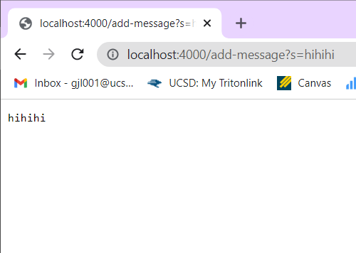
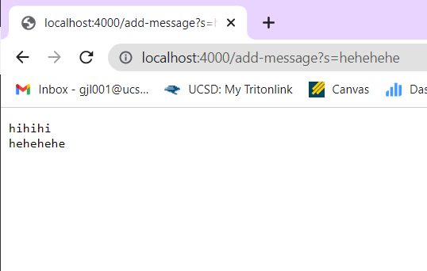

# Lab 2: Servers and Bugs

*Garvey Li*

## Part 1: String Server #

  **String Server Code**

    import java.io.IOException;
    import java.net.URI;

    class Handler implements URLHandler {
        // The one bit of state on the server: a number that will be manipulated by
        // various requests.
        
        String total_String = "";

        public String handleRequest(URI url) {
            if (url.getPath().equals("/")) {
                return "Garvey's String Server!";
            } else if (url.getPath().contains("/add-message")) {
                String[] parameters = url.getQuery().split("=");
                if (parameters[0].equals("s")) {
                    total_String += parameters[1] + "\n";
                    return total_String;
                } else {
                    return "404 Not Found!";
                }
            } else {
                System.out.println("Path: " + url.getPath());
                return "404 Not Found!";
            }
        }
    }

    public class StringServer {
        public static void main(String[] args) throws IOException {
            if(args.length == 0){
                System.out.println("Missing port number! Try any number between 1024 to 49151");
                return;
            }

            int port = Integer.parseInt(args[0]);

            Server.start(port, new Handler());
        }
    }

***/add-message?s=hihihi***

For using /add-message?s=hihihi, the handleRequest method is called. The relevant arguments to this method is the url as a URI object. For this specific call, the url is http://localhost:4000/add-message?s=hihihi. A relevenat field of the class is the String total_String, which is initialized as the empty string "". The getPath() method for URI objects is also called, which returns the URI's path as a String. This method is chained with .contains(String value), which checks if a value is in the String, or url in this case. 

Since the url contains /add-message, it splits the query by '=' and concatenates the value in the last indices of the array made by the split, which in this case is "hihihi", and a newline to the class field total_String. Then, the method returns total_String, which is then displayed on the webpage. Here, total_String is "hihihi\n", so 

hihihi 

is displayed on the webpage.

***/add-message?s=hehehehe***

For using /add-message?s=hehehehe, the handleRequest method is called. The relevant arguments to this method is the url as a URI object. For this specific call, the url is http://localhost:4000/add-message?s=hehehehe. A relevenat field of the class is the String total_String, which was initialized as the empty string "", but is now "hihihi\n" since http://localhost:4000/add-message?s=hihihi was called once before. The getPath() method for URI objects is also called, which returns the URI's path as a String. This method is chained with .contains(String value), which checks if a value is in the String, or url in this case. 

Since the url contains /add-message like before, it splits the query by '=' and concatenates the value in the last indices of the array made by the split, which in this case is "hehehehe", and a newline to the class field total_String. Then, the method returns total_String, which is then displayed on the webpage. Here, total_String is "hihihi\nhehehehe\n", so 

hihihi
hehehehe

is displayed on the webpage.

## Part 2: Bugs #

## Part 3: What I learned #
