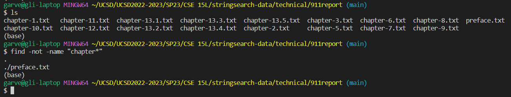
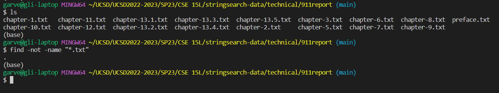
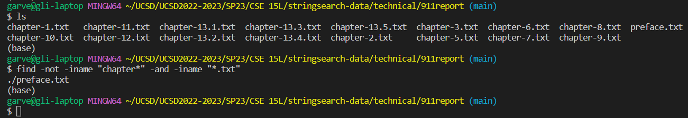
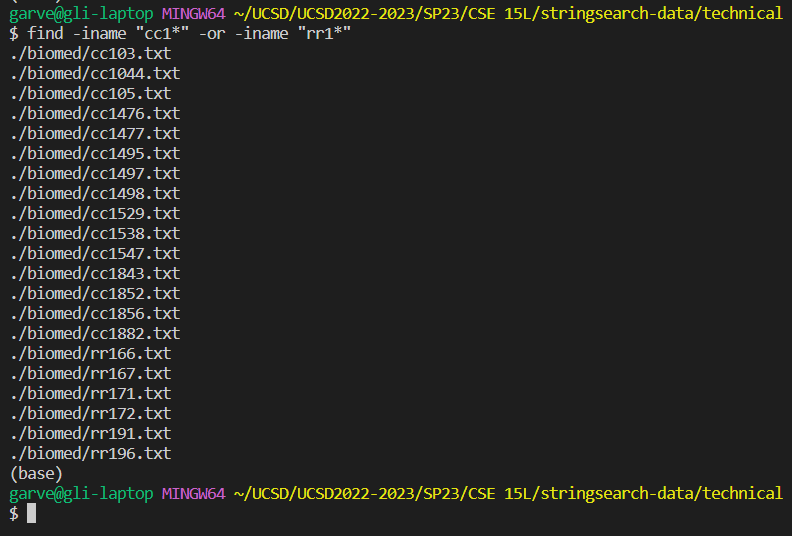
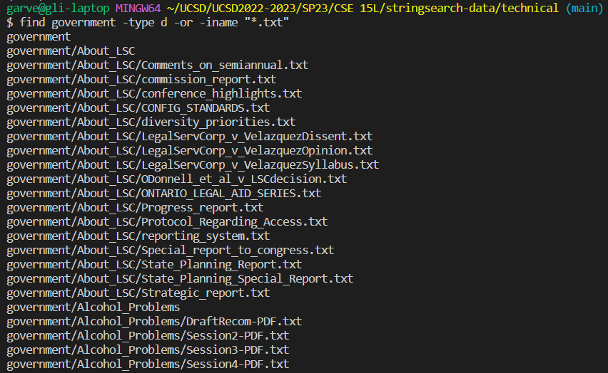

# Lab Report 3: Researching Commands

*Garvey Li*

## Command: `find`

### Command-Line Options

___

### `-iname`

**Explanation**

`-iname` is a command line option for `find` that allows the user to search for a file while ignoring the letter cases in the search parameter and in the file/directory names[ (1)](https://adamtheautomator.com/bash-find/).

In the screenshot below, you can see that there is a directory named `Alcohol_Problems` in the `government` directory. 

When using the command 

`find -name "alcohol_problems"`

nothing is printed in the terminal because the capitalization is not matched. 

In order to find the directory using the same search input, I would have to use 

`find -iname "alcohol_problems"`

which does end up printing the path to the `Alcohol_Problems` directory. 

Generally, it is easier to use a search that ignores letter case if you are unsure about the capitalization of a directory/filename.

___

`find -iname` is also useful for when the file extension itself is not always consistent. Sometimes, a file extention will have weird capitalizations that we probably wouldn't think to use(for example `.png` vs `.PNG`). 

Here, to demonstrate that the file extention is included in the case insensitive search, a search with `.TXT` works on a file whose extension is just `.txt`. 

In the `government` directory, there is a file named `5_Legal_Groups.txt`, and using the command 

`find -name "5_Legal_Groups.TXT"` 

does not succesfully find the file. However, when using the command 

`find -iname "5_Legal_Groups.TXT"` 

the path is succesfully found!

___

### `-not`

**Explanation**

The `-not` command line option for `find` that finds directories and files that don't contain whatever search value is used[ (1)](https://adamtheautomator.com/bash-find/). 

In the `911report` directory, there are a number of files that contain `chapter` in their names. One way to get a file without `chapter` in its name is to use the command 

`find not -name "chapter"`

Here, `-not` is being used to find any files that are not any of the `chapter` files, and it returns `preface.txt`, which is the only file whose name doesn't contain chapter.
___
`find -not` can also be useful if you want to get all files except that of a certain type(s). In the screenshot below, using the command 

`find -not name "*.txt"` 

finds all the files in the `911report` directory that is not a `.txt` file. Since all the files in that directory are `.txt` files, nothing is printed in the terminal.

___

### `-and`

**Explanation**

The `-and` command line option lets us combine multiple arguments when using `find`, and finds the files and directories that satisfy *all* of the arguments[ (1)](https://adamtheautomator.com/bash-find/).

If we were to search for a directory whose name starts with `a` and ends with `c` (case insensitive), we could use the command 

`find -iname "a*" -type d -and -iname "*c"`

which prints the path to the `About_LSC` directory, which does in fact starts with `a` and ends with `c` (case insensitive)

 This can be useful if file or directory names have some organized structure that can be used to search through them and find their paths efficiently.
 ___
 This argument is also useful for finding files of specific names and types if the file names are not unique but the types are different. For example, using the command 

 `find -not -iname "chapter-*" -and -iname "*.txt"` 

 searches for all the files without `chapter` in their names and files that are `.txt` files. This then prints the path to `preface.txt`, which does not have `chapter` in its name and is a `.txt` file.

___
### `-or`

**Explanation**

The `-or` option is similar to the `-and` option, and lets us combine multiple arguments. However, `-or` finds all the files and directories that satisfy ***at least*** one of the arguments[ (1)](https://adamtheautomator.com/bash-find/).

When using the command

`find -iname "cc1*" -or -iname "rr1*"`

The directories and files that contain `cc1` or `rr1` (case insensitive) have their paths printed in the terminal.

This is useful if the filenames are organized in some way and you want to get various categories of the files. 
___
When using the command

`find government -type d -or -iname "*.txt"`

everything in `government` that is directory and all `.txt` files has its path printed.

 So, `-or` can be useful if you want to get limited various filetypes or if you want to filter certain filetypes from multiple directories.

*Sources*

1. [https://adamtheautomator.com/bash-find/](https://adamtheautomator.com/bash-find/)

