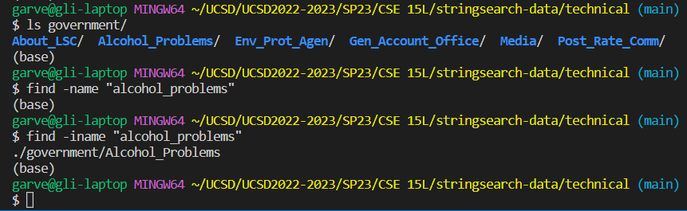
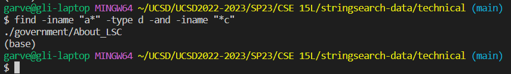

# Lab 3: Researching Commands

*Garvey Li*

## Command: find

**Command-Line Options**

1.`-iname`

*Explanation*

`-iname` is a command line option for `find` that allows the user to search for a file while ignoring the letter cases in the search parameter and in the file/directory names.

Here, you can see that there is a directory named `Alcohol_Problems` in the `government` directory. However, since the name utilizes capital letters throughout the name, it is easier to use a search that ignores letter case.

It is also useful for when the file extension itself is not always consistent. Sometimes, a file extention will have weird capitalizations that we probably wouldn't think to use(for example `.png` vs `.PNG`). Here, to demonstrate that the file extention is included in the case insensitive search, a search with `.TXT` works on a file whose extension is just `.txt`. 

2.`-not`

*Explanation*
The `-not` command line option finds directories and files that don't contain whatever search value is used. 

Here, `-not` is being used to find any files that are not any of the `chapter` files, and it returns `preface.txt`, which is the only file whose name doesn't contain chapter.

`-not` can also be used to exclude file types. In this case, `find -not -name "*.txt"` is searching for all the files in the current directory that are not `.txt` files. This can be useful if you want to get all files except that of a certain type.

3.`-and`

*Explanation*
The `and` command line option lets us combine multiple arguments when using `find`, and finds the files and directories that satisfy *all* of the arguments.

Here, we can search for just directories whose names start with `a` and end with `c` (case insensitive). This can be useful if file names have some organized structure that can be used to search through them efficiently.

In this example, we are looking for files that don't contain `chapter` in their name and are `.txt` files (case insensitive). This shows that we can combine searches and filters for file names using `and`, which is useful if there are multiple files with the same name but are different file types.

4.`-or`

*Explanation*
The `-or` option lets us combine multiple arguments and finds all the files and directories that satisfy *at least* on of the arguments.

In this example, `find -iname "cc1*" -or -iname "rr1*"` finds the directories and files that contain `cc1` or `rr1` (case insensitive). This is useful if the filenames are organized in some way and you want to get various categories of the files. 

This example finds everything in `government` that is directory and all `.txt` files. So, `-or` can be useful if you want to get limited various filetypes. 

*Sources*

[https://adamtheautomator.com/bash-find/](https://adamtheautomator.com/bash-find/)

