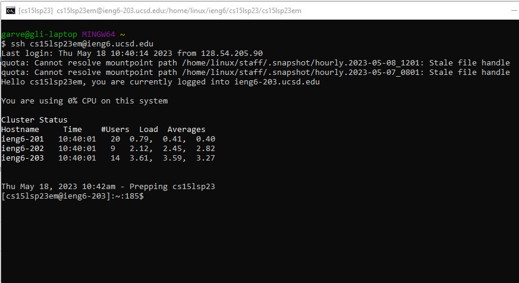
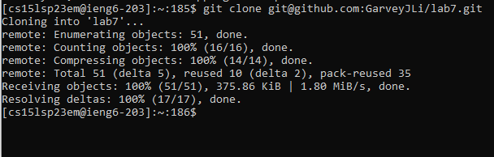
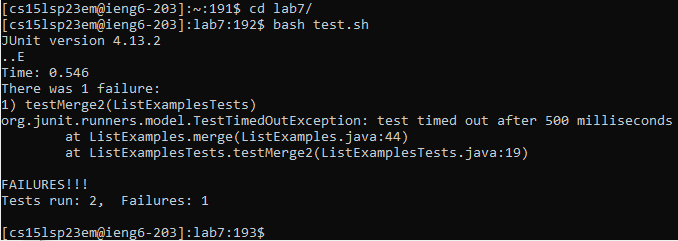
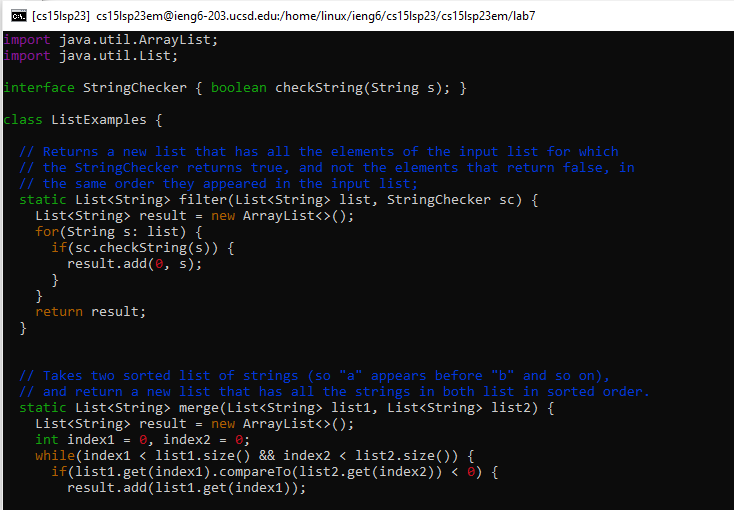
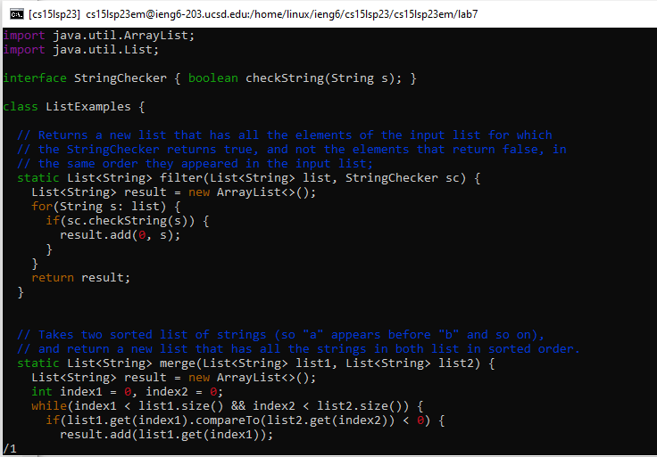
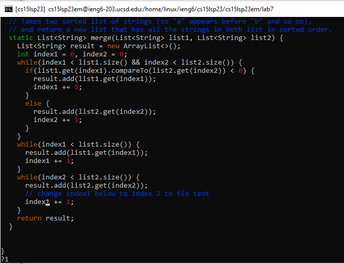
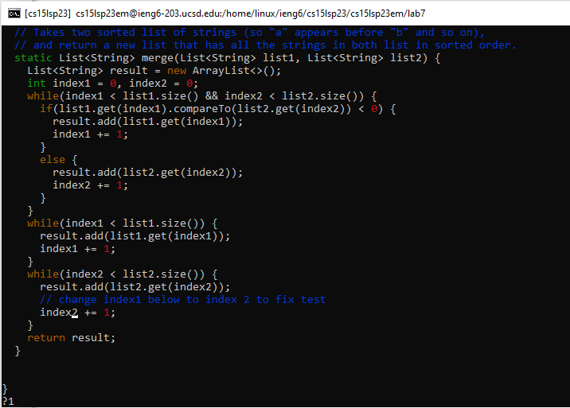
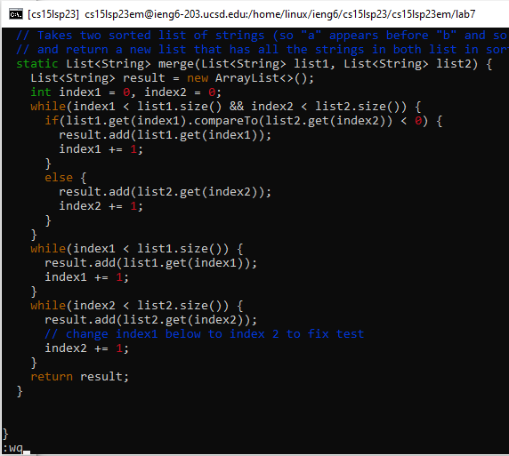
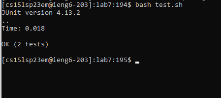
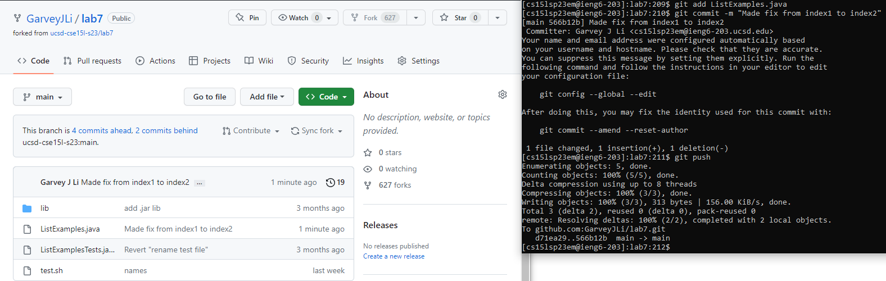

# Lab Report 4: Vim

*Garvey Li*

## Tasks

~~1. Setup Delete any existing forks of the repository you have on your account~~
~~2. Setup Fork the repository~~
~~3. The real deal Start the timer!~~
4. Log into ieng6
5. Clone your fork of the repository from your Github account
6. Run the tests, demonstrating that they fail
7. Edit the code file to fix the failing test
8. Run the tests, demonstrating that they now succeed
9. Commit and push the resulting change to your Github account (you can pick any commit message!)

## Log into ieng6
   

**Keys pressed:** 
`ssh cs15lsp23em@ieng6.ucsd.edu`, `<enter>`

**Summary of commands:**
I typed out `ssh cs15lsp23em@ieng6.ucsd.edu` then pressed `<enter>` to log into my ieng6 server (I didn't need to type in my password).

## Clone your fork of the repository from your Github account
   

**Keys pressed:** 
`git clone `, `<rmb>`, `<enter>`

**Summary of commands:**
I went to the fork I created and got the SSH code link. Then I typed `git clone ` and clicked `<rmb>`(right mouse button) to past the code. Then I pressed `<enter>` to clone the repo into my ieng6 account.

## Run the tests, demonstrating that they fail

**Keys pressed:** 
`cd l`, `<tab>`, `<enter>`, `bash t`, `<tab>`, `<enter>`

**Summary of commands:**
I moved into the lab7 repository using `cd` and `<tab>` to autocomplete `l` to `lab7`. Then I ran the bash script containing the commands to run the JUnit tests using `bash` and `<tab>` to autocomplete `t` to `test.sh`.

## Edit the code file ListExamples.java to fix the failing test. (As a reminder, the error in the code is just that index1 is used instead of index2 in the final loop in merge)

**Keys pressed:** 
`vim L`, `<tab>`, `.`, `<tab>`, `<enter>`

`/1`, `<enter>`, `<shift (and hold)>`, `g`, `n` , `n`, `<Let go of shift>`

`r`, `2`

`<shift> + ;`, `w`, `q`, `<enter>`

**Summary of commands:**

I opened the ListExamples.java file with vim using `<tab>` to autocomplete the file name (All filenames/directories that start with L contain `ListExamples`, and the file we want is `ListExamples.java` and there is only one file/directory with name `ListExamples`, so `.` will autocomplete to `java`). 

Then I searched for the second to last occurence of `1` since index1 is the second to last string in the file that contains `1` (`<shift> + g` goes to the last line, `<shift> + n` goes to the last occurence (opposite of next occurence)).

I replaced the character the cursor was on with `2`, so that the variable name was now `index2` instead of `index1`.

Then I saved and exited with `<shift> + ;`, `w`, `q`, `<enter>`, or `:wq`, `<enter>`

## Run the tests, demonstrating that they now succeed

**Keys pressed:**
`bash t`, `<tab>`, `<enter>`

**Summary of commands:**

I ran the bash script containing the commands to run the JUnit tests again using `bash` and `<tab>` to autocomplete `t` to `test.sh`.

## Commit and push the resulting change to your Github account

**Keys pressed:**
`git add L`, `<tab>`, `.`, `<tab>`

`git commit -m "Made fix from index1 to index2"`

`git push`

**Summary of commands:**

I added and commited the changes to `ListExamples.java` using `git add` and `<tab>` to autocomplete `L` to `ListExamples` and `ListExamples.` to `ListExamples.java`. Then I used `git commit -m` to commit with the message `Made fix from index1 to index2` and pushed the code to my Github account with `git push`.