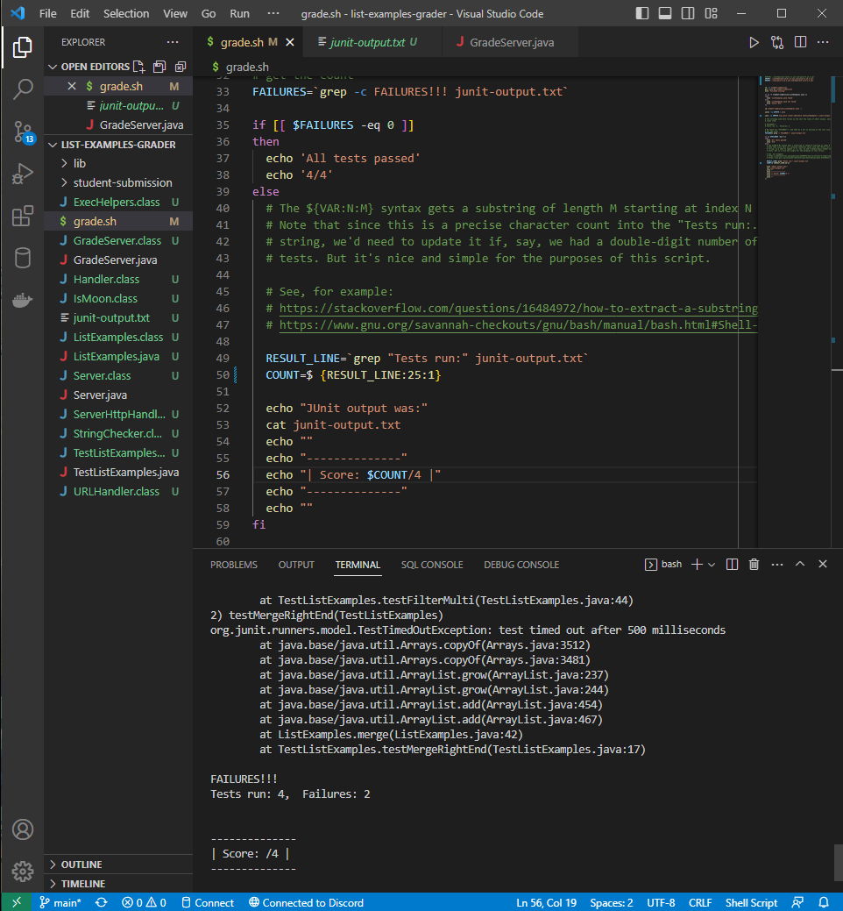
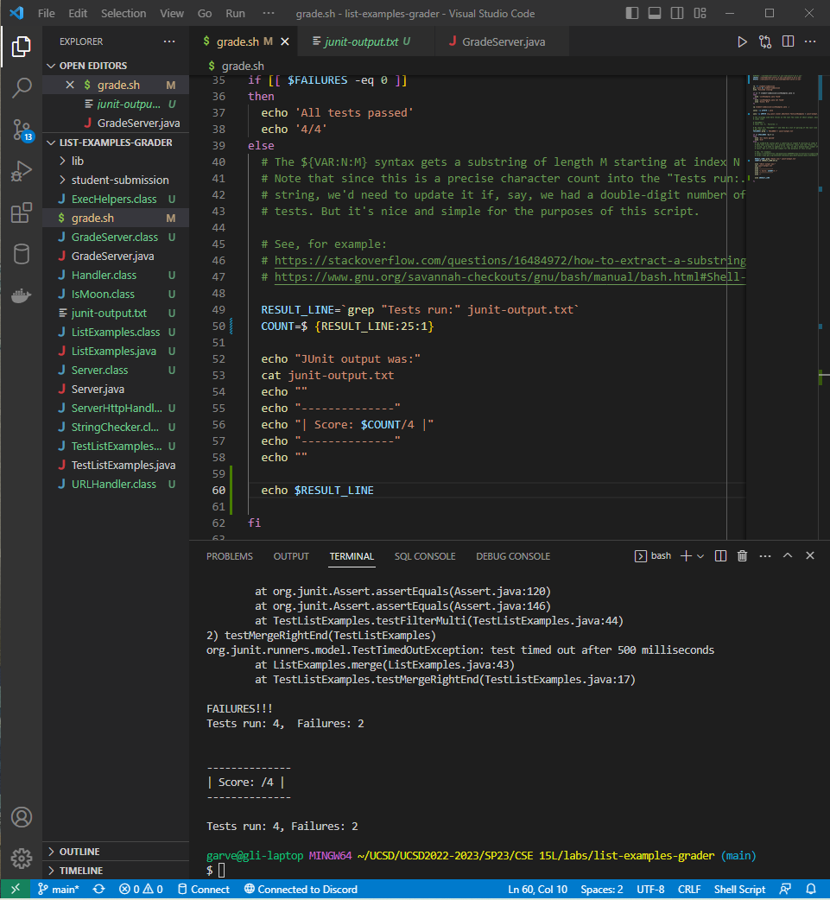

# Lab Report 5: Debugging

*Garvey Li*


## Part 1: Debugging Scenario

### Original Post

#### Lab 6 

**What environment are you using (computer, operating system, web browser, terminal/editor, and so on)?**

Windows PC/OS, VSCode, bash terminal


**Detail the symptom you're seeing. Be specific; include both what you're seeing and what you expected to see instead. Screenshots are great, copy-pasted terminal output is also great. Avoid saying “it doesn't work”.**

In my `grade.sh` file, I am storing the results of a grep on the `junit-ouput.txt` file, which should contain the ouput from running the JUnit tests in `TestListExamples.java`. When I try to store a substring of that result in another variable and try to print it with `echo`, the variable is not printed and there is also no error message shown when this occurs.




**Detail the failure-inducing input and context. That might mean any or all of the command you're running, a test case, command-line arguments, working directory, even the last few commands you ran. Do your best to provide as much context as you can.**

This failure occurs when the bash script is run with any of the lab3 example student repositories that fail any of the JUnit tests (e.g. `bash grade.sh https://github.com/ucsd-cse15l-f22/list-methods-lab3`)

### TA Response

Have you printed/used echo on `RESULT_LINE` or checked that your `junit-output.txt` actually contains the contents of the JUnit output to ensure that there is text to use `grep` on? If the contents of the file and `RESULT_LINE` are correct, maybe make sure you are assigning variable values correctly (make sure your spacing, quotations, brackets, etc are correct).

### Student Response

#### Results from TA's advice


#### Bug Description
The bug in this case is in line 50, where there is a space between `$` and `{RESULT_LINE:25:1}`. Bash interperets spaces where words begin and end as well as as a tab/newline. Since there is a space between `$` and `{RESULT_LINE:25:1}`, the value of the variable `COUNT` is assigned to a whitespace instead of the substring from `RESULT_LINE`. 

### Setup Info

#### File and Directory Structure

Inside the repository, there was a `lib` folder containing the necessary JUnit files, the `GradeServer.java`, `Server.java`, and `TestListExamples.java` files, and the `grade.sh` bash script. 

#### File contents

Before fixing the bug, the `grade.sh` contained the code segment 

```
RESULT_LINE=`grep "Tests run:" junit-output.txt`
COUNT=$ {RESULT_LINE:25:1} 
```

#### Bug inducing command

To trigger the bug, I ran the following line in the repository directory:

`bash grade.sh https://github.com/ucsd-cse15l-f22/list-methods-lab3`

#### Bug Fix Description
To fix the bug, remove the space between `$` and `{RESULT_LINE:25:1}` such that the line of code for assigning a value to `COUNT` is:

`COUNT=${RESULT_LINE:25:1}`

